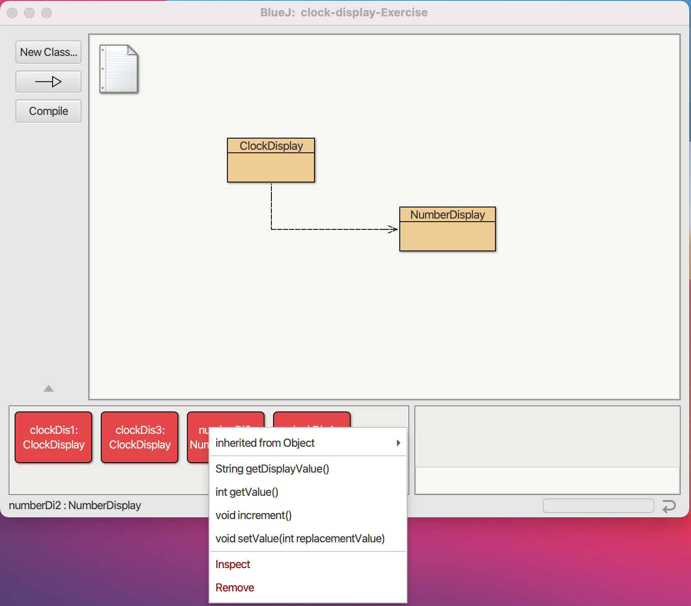
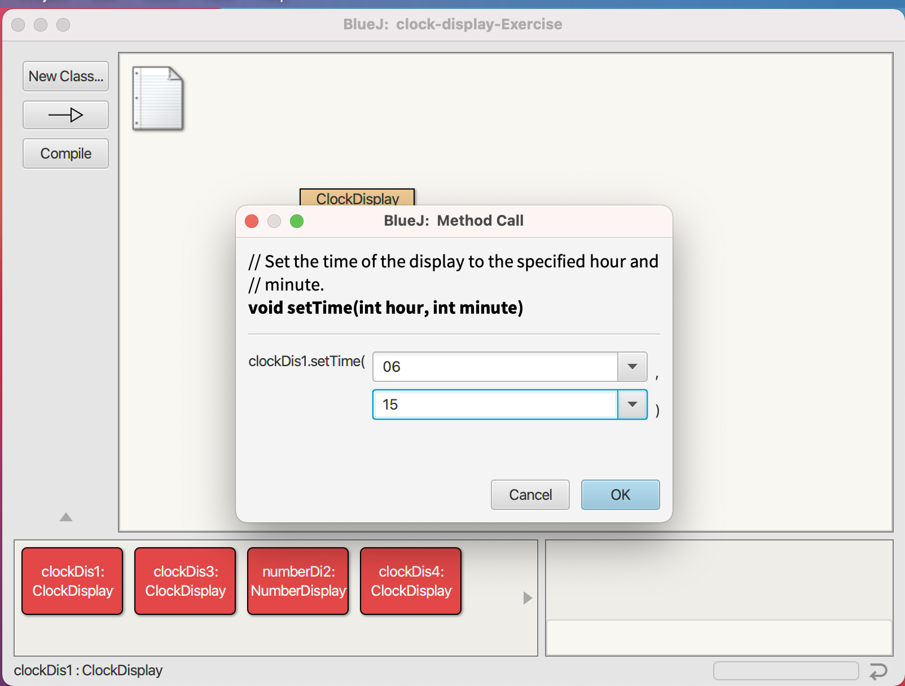

## Clock Display

## Introduction
The ClockDisplay class implements a digital clock display for a
European-style 24 hour clock. The clock shows hours and minutes. The
range of the clock is 00:00 (midnight) to 23:59 (one minute before
midnight).

The clock display receives "ticks" (via the timeTick method) every minute and 
reacts by incrementing the display. This is done in the usual clock
fashion: the hour increments when the minutes roll over to zero.

The NumberDisplay class represents a digital number display that can hold
values from zero to a given limit. The limit can be specified when creating
the display. The values range from zero (inclusive) to limit-1. If used,
for example, for the seconds on a digital clock, the limit would be 60,
resulting in display values from 0 to 59. When incremented, the display
automatically rolls over to zero when reaching the limit.

### Prerequisites
* BLUEJ 4.2.2.

## ScreenShots

## ClockDisplay

## Create New Clock Display

## Create New Number Display

## Create Object Clock Display

## Create Object Number Display

## Functions of Clock Display

## Functions of Number Display

## Get Display Value (Number Display)

## Get Time After Two TimeTick

## Get Time (ClockDisplay)

## Get Value After Incrementing Twice

## Get Value (NumberDisplay)

## Set Time (ClockDisplay)

## Set Time (NumberDisplay)

